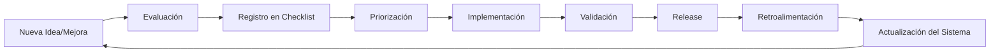

# 🚀 UTP CONTROL - Marco de Trabajo Técnico y Escalable

**Implementación y Evolución Continua del Sistema de Gestión Regional**

---

## 1️⃣ PRINCIPIOS FUNDAMENTALES (MENTALIDAD SILICON VALLEY)

Este proyecto se rige por los siguientes principios:

- ✅ **Documentación viva**: Todo cambia, nada se "cierra" definitivamente
- ✅ **Ownership claro**: Cada tarea tiene un responsable único
- ✅ **Evolución incremental**: Pequeños cambios, releases frecuentes
- ✅ **Calidad por diseño**: Seguridad, performance y UX no son opcionales
- ✅ **Trazabilidad total**: Saber qué se hizo, cuándo, por quién y por qué
- ✅ **Deuda técnica visible**: Lo que no se arregla, se registra

---

## 2️⃣ ESTRUCTURA GENERAL DEL SISTEMA

El marco se divide en 6 capas que se actualizan constantemente:

1. **Visión y alcance** → `VISION.md`
2. **Checklist técnico-funcional** → `TECHNICAL_CHECKLIST.md`
3. **Roadmap y dependencias** → `ROADMAP.md`
4. **Ejecución y ownership** → `OWNERSHIP.md`
5. **Control de calidad, seguridad y performance** → `SECURITY.md` + `QUALITY.md`
6. **Evolución, deuda técnica y releases** → `TECHNICAL_DEBT.md` + `CHANGELOG.md`

---

## 📋 Estado Actual del Proyecto

**Versión**: 1.0.0  
**Última Actualización**: 2026-01-23  
**Próxima Release**: v1.1.0 (planned: 2026-02-15)

### Quick Stats

| Métrica | Valor |
|---------|-------|
| Módulos Implementados | 8/12 (67%) |
| Cobertura de Tests | 0% (pendiente) |
| Deuda Técnica | 15 items |
| Issues Abiertos P0 | 0 |
| Issues Abiertos P1 | 3 |
| Días desde último deploy | - |

---

## 🔄 CICLO DE VIDA DEL SISTEMA (CONTINUO)



---

## 📂 Estructura de Documentación

```
docs/
├── PROJECT_FRAMEWORK.md      # Este archivo - Vista general
├── VISION.md                  # Capa 1 - Visión y alcance
├── TECHNICAL_CHECKLIST.md    # Capa 2 - Desglose funcional/técnico
├── ROADMAP.md                 # Capa 3 - Roadmap e hitos
├── OWNERSHIP.md               # Capa 4 - Responsabilidades
├── SECURITY.md                # Capa 5 - Seguridad (existente)
├── QUALITY.md                 # Capa 5 - Calidad y performance
├── TECHNICAL_DEBT.md          # Capa 6 - Deuda técnica
└── CHANGELOG.md               # Capa 6 - Historial de releases
```

---

## 🎯 Próximos Pasos

1. [ ] Revisar y aprobar VISION.md
2. [ ] Completar TECHNICAL_CHECKLIST.md
3. [ ] Definir hitos en ROADMAP.md
4. [ ] Asignar owners en OWNERSHIP.md
5. [ ] Implementar tests (QUALITY.md)
6. [ ] Documentar deuda técnica actual

---

## 📞 Contacto y Responsables

**Project Owner**: [Nombre]  
**Tech Lead**: [Nombre]  
**DevOps**: [Nombre]  
**Security**: [Nombre]

---

**Última revisión**: 2026-01-23  
**Próxima revisión**: 2026-04-23 (Trimestral)
