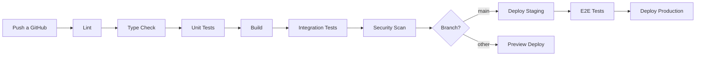

# ✅ CAPA 5 - CALIDAD, SEGURIDAD Y PERFORMANCE

**Objetivo**: Prevenir errores, no solo reaccionar

---

## 📋 Índice

1. [Estrategia de Testing](#estrategia-de-testing)
2. [Métricas de Calidad](#métricas-de-calidad)
3. [Performance](#performance)
4. [Code Quality](#code-quality)
5. [CI/CD Pipeline](#cicd-pipeline)

---

## 🧪 Estrategia de Testing

### Estado Actual

| Tipo de Test | Cobertura | Target | Tool |
|--------------|-----------|--------|------|
| Unit Tests | **0%** | 60% | Jest |
| Integration Tests | **0%** | 40% | Supertest |
| E2E Tests | **0%** | 20% | Playwright |
| Visual Regression | **0%** | - | Chromatic |

---

### Pirámide de Testing

```
        /\
       /E2\      E2E (20%) - Happy paths críticos
      /----\
     /  Int \    Integration (40%) - APIs + DB
    /--------\
   /   Unit   \  Unit (60%) - Lógica de negocio
  /____________\
```

---

### 1️⃣ Tests Unitarios (60% cobertura)

**Objetivo**: Testear lógica aislada sin dependencias externas

**Scope**:
- ✅ Funciones puras
- ✅ Utilities y helpers
- ✅ Componentes React (sin API calls)
- ✅ Validaciones
- ✅ Transformaciones de datos

**Ejemplos**:

```typescript
// ✅ DEBE tener unit test
describe('generateReportCode', () => {
  it('should generate correct format for REGIONAL report', () => {
    const result = generateReportCode({ 
      type: 'REGIONAL', 
      regionId: 'reg-123' 
    });
    expect(result).toMatch(/INF-REG_REG_\d{4}-\d{2}-\d{2}_[A-Z0-9]{4}/);
  });
});
```

**Archivos prioritarios para unit tests**:
- `apps/api/src/reports/reports.service.ts` (generate code, hash)
- `apps/web/src/types/index.ts` (type guards si los hay)
- `apps/web/src/lib/utils.ts` (utilities)
- `apps/web/src/components/ui/*` (componentes sin side effects)

---

### 2️⃣ Tests de Integración (40% cobertura)

**Objetivo**: Validar interacción entre módulos (API + DB)

**Scope**:
- ✅ Endpoints de API completos
- ✅ Flujos con base de datos
- ✅ Autenticación/autorización
- ✅ Validaciones de DTOs

**Ejemplos**:

```typescript
// ✅ Integration test
describe('POST /regional-reports', () => {
  it('should create report and auto-generate alert for HIGH priority', async () => {
    const response = await request(app)
      .post('/regional-reports')
      .send({
        category: 'SECURITY',
        priority: 'HIGH',
        content: 'Critical alert',
      })
      .expect(201);

    // Verificar que se creó el reporte
    expect(response.body.id).toBeDefined();
    
    // Verificar que se creó la alerta automáticamente
    const alerts = await prisma.alert.findMany({
      where: { reportId: response.body.id }
    });
    expect(alerts).toHaveLength(1);
    expect(alerts[0].priority).toBe('HIGH');
  });
});
```

**Endpoints prioritarios**:
- `POST /regional-reports` (con auto-alert)
- `POST /reports` (con SHA-256)
- `GET /regional-reports/hierarchy`
- `POST /documents` (con hash)

---

### 3️⃣ Tests E2E (20% cobertura)

**Objetivo**: Validar user journeys completos en browser

**Scope**:
- ✅ Login flow
- ✅ Happy path principal de cada módulo
- ✅ Flujos críticos de negocio

**Ejemplos con Playwright**:

```typescript
test('Coordinator can publish regional news and staff sees it', async ({ page, context }) => {
  // 1. Login as coordinator
  await page.goto('/login');
  await page.fill('[name=email]', 'coordinator@test.com');
  await page.fill('[name=password]', 'test123');
  await page.click('button[type=submit]');
  
  // 2. Navigate to news
  await page.goto('/dashboard/news');
  await page.click('text=Nueva Noticia');
  
  // 3. Fill form
  await page.fill('[name=content]', 'Alerta de seguridad');
  await page.selectOption('[name=priority]', 'HIGH');
  await page.click('text=Publicar');
  
  // 4. Verify created
  await expect(page.locator('text=Alerta de seguridad')).toBeVisible();
  
  // 5. Login as staff in new context
  const staffPage = await context.newPage();
  await staffPage.goto('/login');
  // ... verify staff sees the news
});
```

**User journeys prioritarios**:
1. Login → Dashboard → Logout
2. Admin publica noticia nacional → Staff recibe
3. Coordinator genera reporte regional
4. Upload documento → Comentar

---

## 📊 Métricas de Calidad

### Definición de Done (DoD)

Una tarea está **DONE** cuando:

- [ ] Código implementado y funcional
- [ ] Tests escritos (según pirámide)
- [ ] Code review aprobado (≥1 approval)
- [ ] Sin linting errors
- [ ] Sin security warnings
- [ ] Documentación actualizada
- [ ] Changelog actualizado
- [ ] Deploy a staging exitoso
- [ ] QA sign-off (para features)

---

### KPIs de Calidad

| Métrica | Actual | Target Q1 | Target Q2 |
|---------|--------|-----------|-----------|
| **Code Coverage** | 0% | 60% | 80% |
| **Build Success Rate** | - | >95% | >98% |
| **Mean Time to Recovery (MTTR)** | - | <4h | <2h |
| **Bugs en Producción/sprint** | - | <5 | <3 |
| **Technical Debt Ratio** | - | <5% | <3% |
| **Security Vulnerabilities** | 0 | 0 | 0 |

---

### Bug Severity & SLA

| Severity | Descripción | Tiempo Resolución | Ejemplo |
|----------|-------------|-------------------|---------|
| **P0** | Sistema caído, data loss | 4 horas | DB down, auth broken |
| **P1** | Feature crítica rota | 24 horas | Reportes no generan, login lento |
| **P2** | Feature no-crítica rota | 3 días | Dashboard chart error |
| **P3** | Mejora, edge case | 1 semana | Typo en UI, scroll bug |

---

## ⚡ Performance

### Targets de Performance

| Métrica | Actual | Target | Tool |
|---------|--------|--------|------|
| **API P95 Latency** | - | <500ms | Sentry |
| **API P99 Latency** | - | <1000ms | Sentry |
| **Page Load (TTI)** | - | <3s | Lighthouse |
| **Largest Contentful Paint** | - | <2.5s | Lighthouse |
| **Cumulative Layout Shift** | - | <0.1 | Lighthouse |
| **Database Query Time** | - | <100ms avg | Prisma logs |

---

### Performance Budget

| Asset Type | Budget | Actual |
|------------|--------|--------|
| JavaScript bundle | <300KB | - |
| CSS | <50KB | - |
| Images | <500KB total | - |
| Fonts | <100KB | - |

**Herramientas**:
- `@next/bundle-analyzer` para analizar bundle
- Lighthouse CI en cada PR
- Prisma query logging en dev

---

### Optimizaciones Implementadas

✅ **Frontend**:
- Next.js 16 con App Router (RSC)
- Image optimization automática
- Code splitting por ruta
- Font optimization (next/font)

✅ **Backend**:
- Prisma ORM con prepared statements
- Connection pooling (Supabase)

⚪ **Pendiente** (v1.2):
- React Query para caching
- Redis para session store
- CDN para assets estáticos
- Database indexes optimizados

---

## 🔍 Code Quality

### Linting & Formatting

**Tools activos**:
- ✅ ESLint (Next.js + TypeScript)
- ✅ Prettier (formatting)
- ⚪ Husky (pre-commit) - Pendiente TD-014

**Configuración**:
```json
{
  "extends": ["next/core-web-vitals", "prettier"],
  "rules": {
    "no-console": "warn",
    "no-unused-vars": "error",
    "@typescript-script/no-explicit-any": "error"
  }
}
```

---

### Code Review Checklist

Cada PR debe cumplir:

**Funcionalidad**:
- [ ] Implementa el requerimiento completo
- [ ] Edge cases considerados
- [ ] Error handling apropiado

**Código**:
- [ ] Nombres descriptivos
- [ ] Funciones <50 líneas
- [ ] Sin código duplicado (DRY)
- [ ] Comentarios donde sea necesario

**Testing**:
- [ ] Tests incluidos
- [ ] Coverage no baja
- [ ] Tests pasan en CI

**Performance**:
- [ ] Sin N+1 queries
- [ ] Lazy loading donde aplique
- [ ] Bundle size no crece >5%

**Seguridad**:
- [ ] Sin secretos en código
- [ ] Input validation
- [ ] SQL injection prevention (Prisma ✅)
- [ ] XSS prevention

---

## 🔄 CI/CD Pipeline

### Pipeline Stages



---

### Checks Automáticos

| Check | Tool | Bloqueante |
|-------|------|------------|
| Linting | ESLint | ✅ Sí |
| Type check | tsc | ✅ Sí |
| Unit tests | Jest | ✅ Sí |
| Build | Next.js/NestJS | ✅ Sí |
| Security scan | Snyk/npm audit | ⚠️ Warning |
| Bundle size | bundlewatch | ⚠️ Warning |
| Lighthouse | Lighthouse CI | ⚠️ Warning |

---

## 🎯 Roadmap de Calidad

### Q1 2026
- [ ] Configurar Jest + Testing Library
- [ ] 60% coverage en unit tests
- [ ] CI/CD básico (lint + build)
- [ ] Lighthouse CI integrado

### Q2 2026
- [ ] 80% coverage total
- [ ] E2E tests con Playwright
- [ ] Performance monitoring (Sentry)
- [ ] Automated security scanning

### Q3 2026
- [ ] Visual regression testing
- [ ] Load testing (k6)
- [ ] Chaos engineering básico

---

## 📞 Responsables

**QA Lead**: [Pendiente]  
**Performance Champion**: [Pendiente]  
**Security Officer**: [Pendiente]

---

**Última actualización**: 2026-01-23  
**Documento versión**: 1.0  
**Próxima revisión**: 2026-02-23
